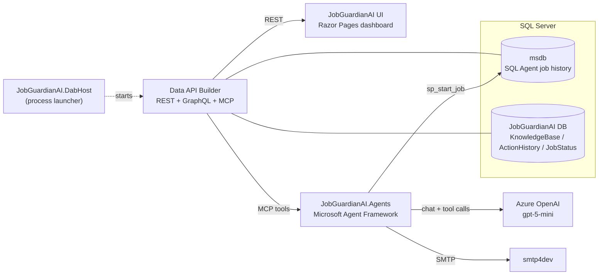
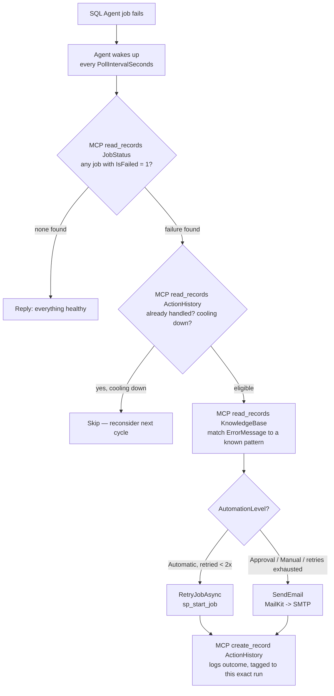

# 🛡️ JobGuardianAI

**An autonomous, self-healing SQL Server Agent job monitor.**
Built for **VS Live 2026** (Redmond) by team **MCP Mavericks**.

[](https://dotnet.microsoft.com/download/dotnet/10.0)
[](https://learn.microsoft.com/azure/ai-services/openai/overview)
[](https://learn.microsoft.com/azure/data-api-builder/overview)
[](https://modelcontextprotocol.io/)
[](https://github.com/microsoft/agent-framework)

---

## 📑 Contents

- [Project Purpose](#-project-purpose)
- [Architecture](#-architecture)
- [Technologies Used](#-technologies-used)
- [Setup & Run Instructions](#-setup--run-instructions)
- [How It Works, End to End](#-how-it-works-end-to-end)

---

## 🎯 Project Purpose

DBAs and on-call engineers waste hours every week doing the same repetitive triage: notice a SQL Agent job failed, dig through the error message, figure out if it's a known issue, decide whether to just retry it or escalate to someone, and log what happened.

**JobGuardianAI automates that entire loop, autonomously.**

It continuously watches SQL Server Agent job history, and for every failure it:

| Step | What happens |
|---|---|
| 🔍 **Diagnoses** | Matches the error message against a knowledge base of known failure patterns and root causes |
| 🧠 **Decides** | Chooses an action based on how much autonomy that failure type is allowed — fully automatic, needs approval, or manual-only |
| ⚡ **Acts** | Restarts the job itself (`sp_start_job`) *or* emails a human — with the reasoning behind the decision |
| 🧾 **Remembers** | Logs every decision so it never spams an unresolved failure, but still gives itself a fresh, full-strength attempt once the job runs again (e.g. after someone fixes a missing file or bad data) |

Every decision and action is logged to an audit trail (`ActionHistory`) and visible on a live operations dashboard — **nothing happens silently.**

---

## 🏗️ Architecture



Three independent .NET processes, one shared source of truth:

- **[Data API Builder](https://learn.microsoft.com/azure/data-api-builder/overview)** is the *only* thing that talks to SQL Server — it turns `KnowledgeBase`, `ActionHistory`, and the `JobStatus` view into REST, GraphQL, **and MCP tools** from one config file ([`dab.config.json`](dab.config.json)).
- **`JobGuardianAI.Agents`** is an LLM agent that *uses* those MCP tools to read/write data, plus two custom C# tools (`RetryJobAsync`, `SendEmail`) to actually take action.
- **`JobGuardianAI`** (UI) is a Razor Pages dashboard that reads the same DAB REST API to show job health and recent activity.

---

## 🧰 Technologies Used

| Layer | Technology |
|---|---|
| Runtime | [.NET 10](https://dotnet.microsoft.com/download/dotnet/10.0) |
| Front end | [ASP.NET Core Razor Pages](https://learn.microsoft.com/aspnet/core/razor-pages/) — `JobGuardianAI` (operations dashboard) |
| Agent worker | .NET 10 Worker Service — `JobGuardianAI.Agents` |
| Agentic framework | [Microsoft Agent Framework](https://github.com/microsoft/agent-framework) (`Microsoft.Agents.AI`, `Microsoft.Agents.AI.OpenAI`) + [`Microsoft.Extensions.AI`](https://learn.microsoft.com/dotnet/ai/microsoft-extensions-ai) |
| LLM | [Azure OpenAI](https://learn.microsoft.com/azure/ai-services/openai/overview) (`gpt-5-mini`) via [Azure AI Foundry](https://learn.microsoft.com/azure/ai-foundry/what-is-ai-foundry), called through the [OpenAI .NET SDK](https://github.com/openai/openai-dotnet) pointed at the Foundry `/openai/v1` endpoint |
| Data access | [Data API Builder (DAB)](https://learn.microsoft.com/azure/data-api-builder/overview) — exposes SQL Server tables/views as REST, GraphQL, **and MCP tools**, with zero hand-written data-access code |
| Agent ↔ data integration | [Model Context Protocol (MCP)](https://modelcontextprotocol.io/) via the [MCP C# SDK](https://github.com/modelcontextprotocol/csharp-sdk) — the agent discovers and calls DAB's `describe_entities` / `read_records` / `create_record` tools directly; no custom REST client |
| Database | [SQL Server](https://www.microsoft.com/en-us/sql-server) — `msdb` (SQL Agent job history) + a dedicated `JobGuardianAI` database |
| Remediation: retry | [`Microsoft.Data.SqlClient`](https://learn.microsoft.com/sql/connect/ado-net/microsoft-data-sqlclient) → `msdb.dbo.sp_start_job` |
| Remediation: notify | [MailKit](https://github.com/jstedfast/MailKit) → SMTP |
| Email testing | [smtp4dev](https://github.com/rnwood/smtp4dev) — a free, local fake SMTP server + web UI, so emails can be seen without a real mailbox |
| Orchestration | `JobGuardianAI.DabHost` — a small wrapper project that launches the `dab` CLI as a managed child process, so DAB starts automatically alongside the UI and Agents on a single F5 in Visual Studio |

### Why this stack?

> **DAB + MCP** eliminates hand-written data-access code entirely — the same config that powers the UI's REST API also powers the AI agent's tools, from one source of truth.
>
> **[Microsoft Agent Framework](https://github.com/microsoft/agent-framework)** gives the agent real tool-calling (MCP tools + custom C# functions) instead of a hand-rolled prompt/response-parsing loop.
>
> **[smtp4dev](https://github.com/rnwood/smtp4dev)** lets the "send email" action be a real, working SMTP send during the demo — zero risk of emailing a real person, zero real credentials to manage.

---

## 🚀 Setup & Run Instructions

### Prerequisites

- [.NET 10 SDK](https://dotnet.microsoft.com/download/dotnet/10.0) (preview)
- [SQL Server](https://www.microsoft.com/en-us/sql-server) (local or remote) with **SQL Server Agent** running
- An [Azure OpenAI](https://learn.microsoft.com/azure/ai-services/openai/overview) / [Azure AI Foundry](https://learn.microsoft.com/azure/ai-foundry/what-is-ai-foundry) resource with a `gpt-5-mini` (or similar) deployment
- The following .NET global tools:

  ```bash
  dotnet tool install --global Microsoft.DataApiBuilder
  dotnet tool install --global Rnwood.Smtp4dev
  ```

### Step 1 — Create the database

Run the setup script against your SQL Server instance:

```bash
sqlcmd -S <your-server> -U <user> -P <password> -C -i McpMaverick/DatabaseScripts/JobExecutionStatus.sql
```

This creates the `JobGuardianAI` database, the `dbo.JobStatus` view (reads live job history from `msdb`), the `dbo.KnowledgeBase` table (seeded with 17 common failure patterns), and the `dbo.ActionHistory` audit table.

> 💡 [`dab.config.json`](dab.config.json) reads its connection string from the `DAB_SQL_CONNECTION_STRING` environment variable (via `@env(...)`) rather than a literal value, so it's safe to commit. `JobGuardianAI.DabHost` sets that variable for you from its own user-secrets — update it there if your server/credentials differ from the defaults:
> ```bash
> dotnet user-secrets set "Sql:ConnectionString" "<your-connection-string>" --project McpMaverick/src/DabHost
> ```

### Step 2 — Configure secrets (never commit these)

`JobGuardianAI.Agents` needs two secrets, sourced from [user-secrets](https://learn.microsoft.com/aspnet/core/security/app-secrets) rather than `appsettings.json` — its own connection string (used by `RetryJobAsync` to call `sp_start_job` directly) and the Azure OpenAI API key:

```bash
dotnet user-secrets set "Sql:ConnectionString" "<your-connection-string>" --project McpMaverick/src/JobGuardianAI.Agents
dotnet user-secrets set "AzureOpenAI:ApiKey" "<your-api-key>" --project McpMaverick/src/JobGuardianAI.Agents
```

The non-secret Azure OpenAI endpoint and deployment name still live in [`McpMaverick/src/JobGuardianAI.Agents/appsettings.json`](McpMaverick/src/JobGuardianAI.Agents/appsettings.json) — update them there directly if they differ.

> As a rule in this repo: **`appsettings.json` holds structure and non-sensitive defaults; anything with a real credential goes in user-secrets** — both `JobGuardianAI.Agents` and `JobGuardianAI.DabHost` follow this, each with their own connection-string secret (see Step 1).

### Step 3 — Start smtp4dev (for the demo email)

```bash
smtp4dev --urls=http://localhost:5100 --smtpport=2525
```

View captured emails at **http://localhost:5100**.

### Step 4 — Run everything

Open [`McpMaverick/src/JobGuardianAI.slnx`](McpMaverick/src/JobGuardianAI.slnx) in Visual Studio and press **F5** — the multi-startup profile launches all three pieces together:

| Project | Role | Address |
|---|---|---|
| `JobGuardianAI.DabHost` | Starts DAB | REST `http://localhost:5000/api` · GraphQL `/graphql` · MCP `/mcp` |
| `JobGuardianAI.Agents` | Autonomous monitoring/remediation worker | — |
| `JobGuardianAI` (UI) | Operations dashboard | `https://localhost:7101` |

Or run each manually from separate terminals:

```bash
# Terminal 1 — DAB
cd McpMaverick/src/DabHost && dotnet run

# Terminal 2 — the agent
cd McpMaverick/src/JobGuardianAI.Agents && dotnet run

# Terminal 3 — the dashboard
cd McpMaverick/src/UI && dotnet run
```

### Tuning the demo

Two settings control the agent's pacing (in `appsettings.json`, or override via `dotnet user-secrets`):

| Setting | Default | Purpose |
|---|---|---|
| `Agent:PollIntervalSeconds` | 60 | How often the agent checks for failed jobs |
| `Agent:RetryCooldownMinutes` | 5 | How long it waits before re-evaluating a still-failing job (lower this for a snappier live demo) |

To watch it react instantly:

```bash
dotnet user-secrets set "Agent:RetryCooldownMinutes" "1" --project McpMaverick/src/JobGuardianAI.Agents
```

---

## 🔁 How It Works, End to End



Nothing is hardcoded about *how* to diagnose or act — the LLM agent reasons over live data through MCP tools every cycle, using `ActionHistory` as its own memory so it never repeats an action it's already taken, while always giving a genuinely new failure a fresh chance.
